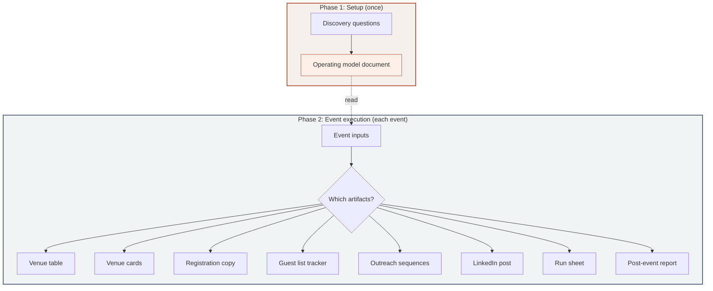
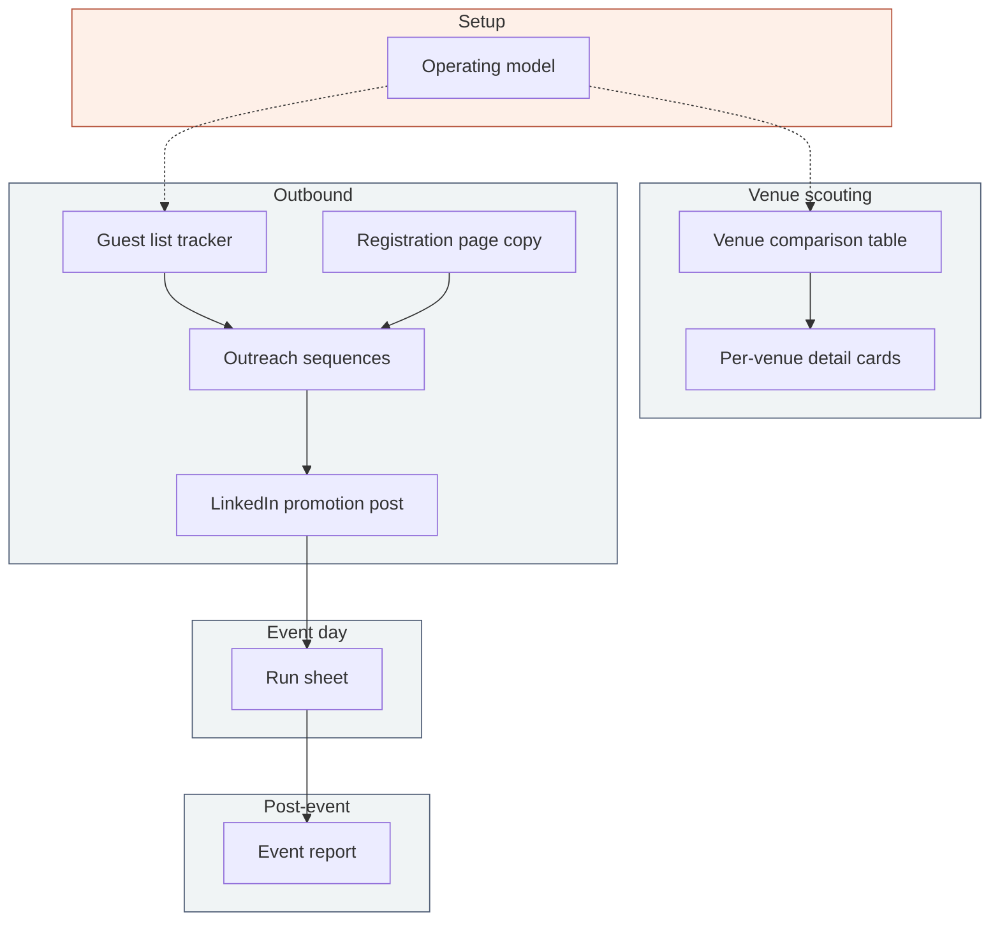

# Great event planning skill

A Claude skill for planning great side events at conferences: dinners, cocktail evenings, breakfasts, or demo nights alongside a larger event.

Built from playbooks used to run 30+ events across Amsterdam, London, Paris, Stockholm, San Francisco, and Copenhagen.

  

## What's inside

- `SKILL.md` — the full skill: setup phase, event execution, 8 artifact templates, guardrails
- `README.md` — this file

The skill produces these artifacts depending on what stage you're at:

1. **Operating model** — reusable playbook (save to Notion / Google Docs, reference for every event)
2. **Venue comparison table** — side-by-side with cost breakdowns showing the math
3. **Per-venue detail cards** — menu pricing, drink packages, tariffs, deposit terms, cost estimate
4. **Registration page copy** — Luma-ready, approval-required, with qualifying questions
5. **Guest list tracker** — Google Sheets structure with status tracking and stats
6. **Outreach sequences** — LinkedIn warm, LinkedIn cold, WhatsApp, with follow-up cadence
7. **LinkedIn promotion post** — personal account, no public link, DM-me pattern
8. **Event-day run sheet** — team roles, timeline, guest list, logistics checklist
9. **Post-event report** — numbers (not vibes), venue rating, follow-up status

## Sample prompts

**Full event planning:**
> We're doing a dinner during SaaStr in SF, co-hosting with Vercel. 20 people, CFOs and finance leaders. Help me plan it.

**First-time setup:**
> Set up the operating model for our event series. We're a billing infrastructure company, we target CFOs and revenue ops, and we run a series called "Revenue Rendezvous."

**Venue scouting:**
> I need to scout venues in Amsterdam for a 25-person dinner on Sep 23 near the RAI in Amsterdam. Private room, budget around €2,500.

**Outreach only:**
> Draft outreach messages for our London Tech Week side event. We've got the guest list ready, 30 people, mix of warm and cold contacts.

**Co-host coordination:**
> We're co-hosting with a company called Pied Piper. They do accounts receivable automation. Help me figure out the theme and split the work.

**Post-event:**
> The dinner was last night. Help me write the event report and draft follow-up messages for each guest.

## How it works

The skill runs in two phases. Setup runs once and produces an operating model you keep in Notion or Google Docs. Event execution runs for each event and produces only the artifacts you need at that stage.

## Operating cadence

Events follow a three-phase timeline. The skill produces artifacts at each phase.

```mermaid
gantt
    title Event timeline (6-week example)
    dateFormat  X
    axisFormat  T-%s

    section Phase A · Setup
    Confirm co-host, agree terms           :a1, 0, 1
    Set up Luma page                       :a2, 1, 2
    Scout & book venue                     :a3, 1, 3
    Build target guest list                :a4, 1, 3
    Get conference attendee list           :a5, 0, 3

    section Phase B · Outbound
    Wave 1 warm outbound                   :b1, 3, 4
    Wave 2 expand outbound                 :b2, 4, 5
    LinkedIn promotion                     :b3, 4, 5
    Follow-up sequence                     :b4, 4, 5

    section Phase C · Execute
    Final confirmations                    :c1, 5, 6
    Confirm headcount with venue           :c2, 5, 6
    Event day                              :milestone, c3, 6, 6
    Follow-up within 48 hours              :c4, 6, 7
    CRM entry & event report              :c5, 6, 7
    Debrief with co-host                   :c6, 6, 7
```

## Artifacts

The skill asks what stage you're at and produces what you need now.

### Operating model

On first use, the skill asks about your company, ICP, event series branding, budget range, and preferred format. It produces a document covering: identity and naming convention, target audience (including the "one level below C-level" insight), co-hosting defaults, per-city budget benchmarks, venue criteria, the 3-phase timeline with owner assignments, outreach principles, and a running venue database.

You save it once and it becomes the reference for every event.

### Venue comparison table

Cost breakdowns show the math, not just totals:

| Restaurant | Location | Space | Cost (25 guests) | Key terms |
|-----------|----------|-------|------------------|-----------|
| Restaurant 1 | Tribeca | Private "Studio" (enclosed, 30-34) | 3-course $2500 incl. BTW = $55pp dinner + $30pp drinks + $2pp water + $500 room | Min. spend $3,000 excl. BTW. The 3-course package sits below it. |
| Restaurant 2 | Soho | Whole venue (fully private) | 3-course + drinks $79pp = $1,975 | No location fee from 12 guests. Up to 36. |
| Restaurant 3 | West village | Semi-private podium (not sound-isolated) | 3-course $52.50pp = $1,313 + $150 rental. Drinks excluded. | Semi-private only. Works for drinks, not for dinner conversation. |

### Per-venue detail card

Each shortlisted venue gets a card with: address, capacity, contact, menu pricing by course count, drink packages (unlimited vs. wine pairing), tariffs and minimum spend, deposit terms, extras with prices, and a cost estimate for your headcount with the arithmetic visible.

### Outreach sequences

Three channels, tailored message sequences:

| Channel | Audience | Cadence |
|---------|----------|---------|
| LinkedIn DM | Warm contacts | Invite → follow-up at day 5 → final nudge at T-3 days |
| LinkedIn DM | Cold targets | Intro + invite → follow-up at day 5 |
| WhatsApp | Existing relationships | One casual message |

Messages are short, personal, sent from a human account. The registration link is never included directly, always sent after a reply.

### Other artifacts

**Registration page copy** follows the pattern: `[Series Name]: [Theme] — [Conference] Edition`. One paragraph on the challenge, one on the format, a simple agenda, one-liner per host. Approval required, never open registration.

**Run sheet** gives the on-site team a one-pager: who does what, timeline, confirmed guest list with conversation notes, logistics checklist.

**Post-event report** captures numbers (invited, confirmed, showed, show rate, ICP match rate, meetings booked), venue rating, what worked, what to change, follow-up status per guest.

## Guardrails

These are baked into every artifact, not a separate checklist:

| Rule | Why |
|------|-----|
| Venue within 2 transit stops of the conference | People are tired after a day of sessions. They skip anything far. |
| Registration link never goes public | Route interest through DMs. Creates exclusivity and lets you curate. |
| Max 3 people per hosting company | More than that and it feels like a sales event, not a peer dinner. |
| No outbound before T-5 weeks | People who confirm 8 weeks out forget or cancel. Build the list early, hold invites. |
| Max one 15-min fireside, if any | Guests spent all day listening to panels. They want to talk. |
| Follow-up within 48 hours | The dinner is the beginning of the relationship, not the end. |

## Co-hosting

Most events work better with a co-host that has an overlapping audience and a non-competing product.

The skill will coordinate: 50/50 cost split, max 3 people per company, shared Google Sheet for the guest list (double-inviting the same person is encouraged), co-host as Luma editor, each side adds qualifying questions to registration, local co-host scouts venues, both sides post from personal LinkedIn accounts.

## Installation

Save `great-event-planning.skill` to your Claude skills.

## License

MIT License - use these prompts however you want, commercially or personally.

See [LICENSE](./LICENSE) for details.

---

## About

  <strong>If this skill helps you organize events, give it a star!</strong>
   
  Built by Arnon Shimoni

| Resource | Link |
|----------|------|
| LinkedIn | [Arnon Shimoni](https://www.linkedin.com/in/arnon-shimoni/) |
| Blog | [Arnon's blog](https://arnon.dk) |
| Email | arnon@omg.lol |
